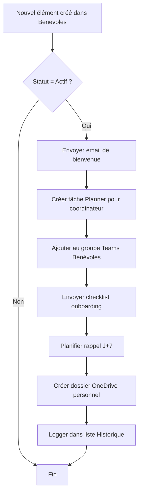
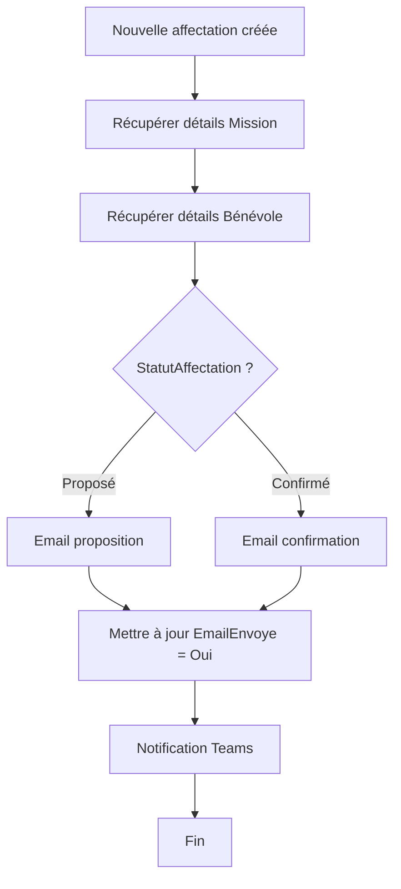

# Workflows Power Automate - Gestion Bénévoles

**Date:** 18 novembre 2025  
**Environnement:** Microsoft 365 + SharePoint Online

---

## Vue d'ensemble des flux

### Flux automatisés
1. **Onboarding nouveau bénévole** (déclencheur: création Bénévoles)
2. **Notification affectation mission** (déclencheur: création Affectations)
3. **Rappel mise à jour disponibilités** (planifié hebdomadaire)
4. **Alerte missions urgentes non pourvues** (planifié quotidien)
5. **Alerte expiration documents** (planifié hebdomadaire)
6. **Confirmation affectation bénévole** (déclencheur: email de réponse)
7. **Workflow approbation clôture mission** (déclencheur: changement statut)

---

## 📋 Flux 1: Onboarding Nouveau Bénévole

### Informations générales
- **Nom:** `Onboarding - Nouveau bénévole`
- **Déclencheur:** Quand un élément est créé (SharePoint - Benevoles)
- **Type:** Automatisé
- **Propriétaire:** Administrateurs

### Étapes du flux



### Détail des actions

**1. Condition: Vérifier statut**
```
Condition: @equals(triggerOutputs()?['body/Statut/Value'], 'Actif')
```

**2. Action: Email de bienvenue**
- **Action:** Envoyer un courrier électronique (V2) - Office 365 Outlook
- **Destinataire:** `@{triggerOutputs()?['body/Email']}`
- **Objet:** `Bienvenue chez SAS Bénévolat, @{triggerOutputs()?['body/Prenom']} !`
- **Corps:**
```html
<html>
<body>
  <h2>Bienvenue @{triggerOutputs()?['body/Prenom']} !</h2>
  <p>Nous sommes ravis de vous compter parmi nos bénévoles.</p>
  
  <h3>Vos prochaines étapes:</h3>
  <ul>
    <li>✅ Compléter votre profil dans l'application</li>
    <li>📅 Renseigner vos disponibilités</li>
    <li>📄 Télécharger les documents requis (certificat médical si applicable)</li>
  </ul>
  
  <p><strong>Votre numéro de bénévole:</strong> @{triggerOutputs()?['body/NumeroBenevole']}</p>
  
  <p>À très bientôt !<br>L'équipe SAS</p>
</body>
</html>
```

**3. Action: Créer tâche Planner**
- **Action:** Créer une tâche - Planner
- **Titre:** `Onboarding: @{triggerOutputs()?['body/Title']}`
- **Plan:** `Gestion Bénévoles`
- **Compartiment:** `Nouveaux arrivants`
- **Affecté à:** Coordinateur principal
- **Date d'échéance:** `@{addDays(utcNow(), 7)}`
- **Description:**
```
Nouveau bénévole à accueillir:
- Nom: @{triggerOutputs()?['body/Title']}
- Email: @{triggerOutputs()?['body/Email']}
- Compétences: @{join(triggerOutputs()?['body/Competences'], ', ')}
- Date d'entrée: @{triggerOutputs()?['body/DateEntree']}

Actions à réaliser:
[ ] Contact téléphonique de bienvenue
[ ] Présentation de l'association
[ ] Vérification documents
[ ] Première affectation
```

**4. Action: Ajouter au groupe Teams**
- **Action:** Ajouter un membre à une équipe - Microsoft Teams
- **Équipe:** `Bénévoles SAS`
- **Utilisateur:** `@{triggerOutputs()?['body/Email']}`

**5. Action: Email checklist**
- **Action:** Envoyer un courrier électronique (V2)
- **Destinataire:** Bénévole + Coordinateur
- **Objet:** `Checklist onboarding - @{triggerOutputs()?['body/Title']}`
- **Pièce jointe:** PDF checklist (stocké dans SharePoint)

**6. Action: Planifier rappel**
- **Action:** Envoyer un courrier électronique avec délai
- **Délai:** 7 jours
- **Destinataire:** Coordinateur
- **Objet:** `Rappel: Suivi onboarding @{triggerOutputs()?['body/Title']}`

**7. Action: Créer dossier OneDrive**
- **Action:** Créer un dossier - OneDrive Entreprise
- **Chemin:** `/Bénévoles/@{triggerOutputs()?['body/NumeroBenevole']}_@{triggerOutputs()?['body/Nom']}`

**8. Action: Logger historique**
- **Action:** Créer un élément - SharePoint
- **Liste:** `HistoriqueActions`
- **Champs:**
  - Action: `Onboarding initié`
  - BenevoleID: `@{triggerOutputs()?['body/ID']}`
  - Date: `@{utcNow()}`
  - Détails: `Onboarding automatique déclenché avec succès`

---

## 📨 Flux 2: Notification Affectation Mission

### Informations générales
- **Nom:** `Notification - Proposition affectation mission`
- **Déclencheur:** Quand un élément est créé (SharePoint - Affectations)
- **Type:** Automatisé

### Étapes du flux



### Actions détaillées

**1. Récupérer mission**
- **Action:** Obtenir un élément - SharePoint
- **Liste:** Missions
- **ID:** `@{triggerOutputs()?['body/MissionID/Id']}`

**2. Récupérer bénévole**
- **Action:** Obtenir un élément - SharePoint
- **Liste:** Benevoles
- **ID:** `@{triggerOutputs()?['body/BenevoleID/Id']}`

**3. Condition selon statut**

**Branche A: Si Proposé**

**Email au bénévole:**
```html
<html>
<body>
  <h2>Nouvelle proposition de mission 📋</h2>
  
  <p>Bonjour @{outputs('Obtenir_Benevole')?['body/Prenom']},</p>
  
  <p>Nous avons une mission qui pourrait vous intéresser:</p>
  
  <div style="border: 1px solid #ddd; padding: 15px; margin: 10px 0;">
    <h3>@{outputs('Obtenir_Mission')?['body/Title']}</h3>
    <p><strong>📅 Date:</strong> @{formatDateTime(outputs('Obtenir_Mission')?['body/DateDebut'], 'dd/MM/yyyy HH:mm')}</p>
    <p><strong>📍 Lieu:</strong> @{outputs('Obtenir_Mission')?['body/Lieu']}</p>
    <p><strong>📝 Description:</strong></p>
    <p>@{outputs('Obtenir_Mission')?['body/Description']}</p>
    <p><strong>🛠️ Compétences:</strong> @{join(outputs('Obtenir_Mission')?['body/CompetencesRequises'], ', ')}</p>
  </div>
  
  <p><strong>Êtes-vous disponible ?</strong></p>
  <p>
    <a href="mailto:benevoles@sas.ch?subject=Acceptation mission @{outputs('Obtenir_Mission')?['body/CodeMission']}&body=Je confirme ma participation" 
       style="background: #4CAF50; color: white; padding: 10px 20px; text-decoration: none; border-radius: 5px;">
      ✅ Je confirme
    </a>
    
    <a href="mailto:benevoles@sas.ch?subject=Refus mission @{outputs('Obtenir_Mission')?['body/CodeMission']}&body=Je ne suis malheureusement pas disponible" 
       style="background: #f44336; color: white; padding: 10px 20px; text-decoration: none; border-radius: 5px; margin-left: 10px;">
      ❌ Je refuse
    </a>
  </p>
  
  <p>Vous pouvez également répondre directement à cet email.</p>
  
  <p>Merci pour votre engagement !<br>L'équipe SAS</p>
</body>
</html>
```

**Branche B: Si Confirmé**

**Email de confirmation:**
```html
<html>
<body>
  <h2>Confirmation de mission ✅</h2>
  
  <p>Bonjour @{outputs('Obtenir_Benevole')?['body/Prenom']},</p>
  
  <p>Votre participation à la mission suivante est confirmée:</p>
  
  <div style="border: 2px solid #4CAF50; padding: 15px; margin: 10px 0; background: #f1f8f4;">
    <h3>@{outputs('Obtenir_Mission')?['body/Title']}</h3>
    <p><strong>📅 Date:</strong> @{formatDateTime(outputs('Obtenir_Mission')?['body/DateDebut'], 'dd/MM/yyyy HH:mm')}</p>
    <p><strong>📍 Rendez-vous:</strong> @{outputs('Obtenir_Mission')?['body/Lieu']}</p>
    <p><strong>👤 Responsable:</strong> @{outputs('Obtenir_Mission')?['body/Responsable/DisplayName']}</p>
    @{if(not(empty(triggerOutputs()?['body/PlageHoraire1'])), 
        concat('<p><strong>🕐 Horaire:</strong> ', triggerOutputs()?['body/PlageHoraire1'], '</p>'), 
        '')}
  </div>
  
  <h4>📋 Rappels importants:</h4>
  <ul>
    <li>Merci d'arriver 10 minutes avant le début</li>
    <li>En cas d'empêchement, prévenez au plus vite</li>
    <li>Pensez à déclarer vos heures après la mission</li>
  </ul>
  
  <p>À bientôt et merci pour votre engagement !<br>L'équipe SAS</p>
  
  <p style="font-size: 0.9em; color: #666;">
    <strong>Ajoutez cet événement à votre agenda:</strong><br>
    📅 <a href="[Lien iCal généré]">Ajouter au calendrier</a>
  </p>
</body>
</html>
```

**4. Mise à jour flag EmailEnvoye**
- **Action:** Mettre à jour un élément - SharePoint
- **Liste:** Affectations
- **ID:** `@{triggerOutputs()?['body/ID']}`
- **Champs:** EmailEnvoye = Oui

**5. Notification Teams (optionnel)**
- **Action:** Publier un message sur un canal - Microsoft Teams
- **Équipe:** Bénévoles SAS
- **Canal:** Missions
- **Message:**
```
**Nouvelle affectation** 
👤 @{outputs('Obtenir_Benevole')?['body/Title']} 
📋 @{outputs('Obtenir_Mission')?['body/Title']} 
📅 @{formatDateTime(outputs('Obtenir_Mission')?['body/DateDebut'], 'dd/MM/yyyy')}
```

---

## 📅 Flux 3: Rappel Mise à Jour Disponibilités

### Informations générales
- **Nom:** `Rappel - Mise à jour disponibilités`
- **Déclencheur:** Récurrence (Planifié)
- **Fréquence:** Hebdomadaire, chaque lundi 9h00
- **Type:** Planifié

### Logique du flux

**1. Récurrence**
- Fréquence: Semaine
- Jour: Lundi
- Heure: 09:00

**2. Récupérer bénévoles à relancer**
```
Action: Obtenir des éléments - SharePoint
Liste: Benevoles
Filtre: Statut eq 'Actif' and DateDerniereMajProfil lt '@{addDays(utcNow(), -90)}'
```

**3. Appliquer à chacun (boucle)**
- **Variable:** `item()` (chaque bénévole)

**4. Dans la boucle: Envoyer email de rappel**
```html
<html>
<body>
  <h2>Mise à jour de vos disponibilités 📅</h2>
  
  <p>Bonjour @{item()?['Prenom']},</p>
  
  <p>Nous avons remarqué que vos disponibilités n'ont pas été mises à jour depuis plus de 3 mois 
  (dernière modification: @{formatDateTime(item()?['DateDerniereMajProfil'], 'dd/MM/yyyy')}).</p>
  
  <p>Pour nous aider à mieux organiser les missions, pourriez-vous prendre quelques minutes 
  pour actualiser votre planning ?</p>
  
  <p>
    <a href="[Lien vers Power Apps - Écran Disponibilités]" 
       style="background: #2196F3; color: white; padding: 12px 24px; text-decoration: none; border-radius: 5px;">
      📅 Mettre à jour mes disponibilités
    </a>
  </p>
  
  <p>Merci pour votre collaboration !<br>L'équipe SAS</p>
</body>
</html>
```

**5. Logger action**
- Créer élément dans liste HistoriqueActions

---

## ⚠️ Flux 4: Alerte Missions Urgentes Non Pourvues

### Informations générales
- **Nom:** `Alerte - Missions urgentes non pourvues`
- **Déclencheur:** Récurrence quotidienne
- **Fréquence:** Chaque jour à 08:00
- **Type:** Planifié

### Logique

**1. Récupérer missions critiques**
```
Filtre OData: 
  Priorite eq 'Haute' or Priorite eq 'Critique'
  and PlacesRestantes gt 0
  and DateDebut le '@{addDays(utcNow(), 7)}'
  and StatutMission eq 'Planifiée'
```

**2. Condition: Y a-t-il des missions ?**
```
@greater(length(outputs('Obtenir_missions')?['body/value']), 0)
```

**3. Si oui: Créer tableau HTML**
```html
<table style="border-collapse: collapse; width: 100%;">
  <thead>
    <tr style="background: #f44336; color: white;">
      <th>Mission</th>
      <th>Date</th>
      <th>Places manquantes</th>
      <th>Priorité</th>
    </tr>
  </thead>
  <tbody>
    @{
      // Boucle sur chaque mission pour générer lignes tableau
      join(
        body('Obtenir_missions')?['value'],
        concat(
          '<tr>',
          '<td>', item()?['Title'], '</td>',
          '<td>', formatDateTime(item()?['DateDebut'], 'dd/MM HH:mm'), '</td>',
          '<td style="text-align: center; font-weight: bold;">', item()?['PlacesRestantes'], '</td>',
          '<td>', item()?['Priorite'], '</td>',
          '</tr>'
        )
      )
    }
  </tbody>
</table>
```

**4. Envoyer email aux coordinateurs**
- Destinataires: Groupe "Coordinateurs Bénévoles"
- Objet: `⚠️ URGENT: ${length(outputs('Obtenir_missions')?['body/value'])} mission(s) à pourvoir`
- Corps: Tableau HTML + lien vers Power Apps

**5. Publier dans Teams**
- Canal: #alertes
- @mention groupe coordinateurs

---

## 📄 Flux 5: Alerte Expiration Documents

### Informations générales
- **Nom:** `Alerte - Documents expirant bientôt`
- **Déclencheur:** Récurrence hebdomadaire
- **Fréquence:** Chaque vendredi 10:00

### Logique

**1. Récupérer documents expir ant dans 30 jours**
```
Filtre:
  DateExpiration le '@{addDays(utcNow(), 30)}'
  and DateExpiration gt '@{utcNow()}'
  and Valide eq 1
```

**2. Grouper par bénévole**
- Utiliser action "Sélectionner" pour extraire BenevoleID unique

**3. Pour chaque bénévole: Envoyer email personnalisé**
```html
<html>
<body>
  <h2>Renouvellement de documents ⚠️</h2>
  
  <p>Bonjour @{item()?['Prenom']},</p>
  
  <p>Un ou plusieurs de vos documents arrivent à expiration:</p>
  
  <ul>
    @{
      // Liste des documents du bénévole
      join(
        filter(outputs('Obtenir_documents')?['value'], 
               equals(item()?['BenevoleID/Id'], item()?['ID'])),
        concat(
          '<li><strong>', item()?['TypeDocument/Value'], '</strong> - ',
          'Expire le ', formatDateTime(item()?['DateExpiration'], 'dd/MM/yyyy'),
          if(lessOrEquals(item()?['DateExpiration'], addDays(utcNow(), 7)), 
             ' ⚠️ <span style="color: red;">URGENT</span>', 
             ''),
          '</li>'
        )
      )
    }
  </ul>
  
  <p>Merci de nous transmettre les documents renouvelés au plus vite.</p>
  
  <p>
    <a href="[Lien Power Apps - Upload document]" 
       style="background: #FF9800; color: white; padding: 10px 20px; text-decoration: none;">
      📤 Télécharger nouveau document
    </a>
  </p>
</body>
</html>
```

---

## ✅ Flux 6: Confirmation Affectation par Email

### Informations générales
- **Nom:** `Traitement - Réponse confirmation mission`
- **Déclencheur:** Quand un nouveau courrier arrive (V3) - Office 365 Outlook
- **Filtre objet:** Commence par "Acceptation mission" ou "Refus mission"
- **Type:** Automatisé

### Logique

**1. Déclencheur email**
- Dossier: Boîte de réception
- Objet contient: "mission"

**2. Analyser objet de l'email**
```
Action: Composer
Entrées: @{split(triggerOutputs()?['body/subject'], ' ')[2]}
// Extrait le CodeMission de l'objet
```

**3. Récupérer affectation correspondante**
```
Filtre: MissionID/CodeMission eq '@{outputs('Composer')}'
        and BenevoleID/Email eq '@{triggerOutputs()?['body/from']}'
```

**4. Condition: Acceptation ou refus ?**
```
@contains(toLower(triggerOutputs()?['body/subject']), 'acceptation')
```

**Branche Acceptation:**
- Mettre à jour Affectation: StatutAffectation = "Confirmé", DateConfirmation = Now()
- Envoyer email confirmation avec détails
- Créer événement Outlook

**Branche Refus:**
- Mettre à jour Affectation: StatutAffectation = "Annulé"
- Envoyer email accusé réception
- Notifier coordinateur

**5. Logger action**

---

## 🔄 Flux 7: Workflow Approbation Clôture Mission

### Informations générales
- **Nom:** `Approbation - Clôture mission`
- **Déclencheur:** Quand un élément est modifié (SharePoint - Missions)
- **Type:** Automatisé

### Logique

**1. Déclencheur modification**
- Liste: Missions

**2. Condition: StatutMission changé vers "Clôturée" ?**
```
@and(
  equals(triggerOutputs()?['body/StatutMission/Value'], 'Clôturée'),
  not(equals(triggerBody()?['body/StatutMission/Value'], 'Clôturée'))
)
```

**3. Récupérer affectations de la mission**
```
Filtre: MissionID/ID eq @{triggerOutputs()?['body/ID']}
        and StatutAffectation eq 'Confirmé'
```

**4. Vérifier: Toutes les heures sont déclarées ?**
```
Condition: @equals(
  length(filter(outputs('Obtenir_affectations')?['value'], 
                empty(item()?['HeuresDeclarees']))),
  0
)
```

**5a. Si heures manquantes:**
- Envoyer email au responsable mission
- Bloquer clôture (revert StatutMission)
- Notifier "Impossible de clôturer: heures non déclarées"

**5b. Si tout OK:**
- Démarrer approbation (bouton Teams ou email)
- Destinataire: Administrateur
- Message: Demande clôture mission + résumé

**6. Attendre approbation**
- Action: "Démarrer et attendre une approbation"
- Timeout: 3 jours

**7. Selon réponse:**

**Si approuvé:**
- Confirmer clôture
- Archiver documents
- Envoyer email remerciement bénévoles
- Créer rapport automatique

**Si refusé:**
- Revert statut vers "En cours"
- Notifier responsable avec motif

---

## 🔧 Bonnes pratiques Power Automate

### Nommage des flux
- Préfixe par catégorie: `Onboarding -`, `Notification -`, `Alerte -`, `Approbation -`
- Nom explicite et court

### Gestion des erreurs
- **Configurer dans chaque action:**
  - Délai d'expiration: 2 minutes
  - Stratégie de nouvelle tentative: Exponentielle, 3 tentatives

**Scope de gestion d'erreur:**
```
Action: Étendue (Scope)
  └─ Actions principales
  
Action: Étendue (Scope) "Gestion erreur"
Condition: "Exécuter après" = Scope principal a échoué
  └─ Envoyer email erreur à admin
  └─ Logger dans liste Erreurs
```

### Performances
- Utiliser filtres OData pour limiter données récupérées
- Pagination activée sur "Obtenir des éléments"
- Limiter actions dans boucles (max 100 itérations)

### Sécurité
- Connexions avec comptes de service (pas comptes personnels)
- Chiffrer données sensibles dans variables
- Auditer exécutions mensuellement

---

## ✅ Checklist création workflows

### Flux critiques (priorité 1)
- [ ] Onboarding nouveau bénévole
- [ ] Notification affectation mission
- [ ] Alerte missions urgentes

### Flux secondaires (priorité 2)
- [ ] Rappel disponibilités
- [ ] Alerte expiration documents
- [ ] Confirmation par email

### Flux avancés (priorité 3)
- [ ] Workflow approbation clôture
- [ ] Génération rapports automatiques
- [ ] Synchronisation calendrier

### Tests
- [ ] Tester chaque flux avec données réelles
- [ ] Vérifier gestion erreurs
- [ ] Valider performances (< 2 min/exécution)
- [ ] Documenter pour maintenance

---

**Prochaine étape:** Créer les scripts PowerShell de migration des données Access.
