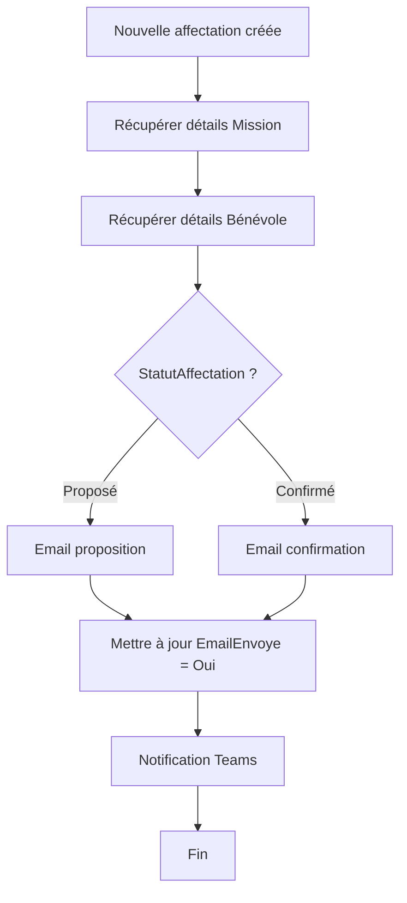

# Guide Power Automate - Workflows Gestion Bénévoles

**Version:** 2.0  
**Date:** 8 décembre 2025  
**Auteur:** Documentation du projet SAS Bénévolat

---

## Table des Matières

1. [Vue d'ensemble](#vue-densemble)
2. [Prérequis et Configuration](#prérequis-et-configuration)
3. [Flux Prioritaires](#flux-prioritaires)
4. [Configuration Détaillée des Workflows](#configuration-détaillée-des-workflows)
5. [Templates d'Emails](#templates-demails)
6. [Tests et Déploiement](#tests-et-déploiement)
7. [Monitoring et Maintenance](#monitoring-et-maintenance)

---

## Vue d'ensemble

### Objectif des Workflows

Automatiser les processus clés de la gestion des bénévoles pour :
- Réduire la charge administrative des coordinateurs
- Améliorer la communication avec les bénévoles
- Garantir le suivi des affectations et prestations
- Alerter sur les situations nécessitant une attention

### Architecture des Flux

```
SharePoint Lists ──┐
Power Apps ────────┼──> Power Automate ──┬──> Emails (Outlook)
Calendrier ────────┘                      ├──> Teams
                                          ├──> Planner
                                          └──> Notifications Push
```

### Liste des Workflows Essentiels

| # | Nom du Flux | Type | Déclencheur | Priorité |
|---|-------------|------|-------------|----------|
| 1 | Bienvenue nouveau bénévole | Automatisé | Création Benevoles | Haute |
| 2 | Notification d'affectation | Automatisé | Création Affectations | Haute |
| 3 | Rappel confirmation affectation | Planifié | Quotidien (8h00) | Moyenne |
| 4 | Rappel mission à venir | Planifié | Quotidien (18h00) | Haute |
| 5 | Alerte prestation non visitée | Planifié | Hebdomadaire (Lundi 9h) | Haute |
| 6 | Rapport hebdomadaire coordinateurs | Planifié | Vendredi 17h | Moyenne |
| 7 | Validation clôture mission | Approbation | Changement StatutMission | Moyenne |

---

## Prérequis et Configuration

### Accès Requis

1. **Licence Power Automate** : Premium (pour connecteurs premium)
2. **Permissions SharePoint** : Éditeur ou Propriétaire
3. **Boîte email partagée** : benevoles@serrentino.ch (recommandé)
4. **Accès Planner** : Pour créer des tâches

### Configuration Initiale

1. Connectez-vous à [make.powerautomate.com](https://make.powerautomate.com)
2. Sélectionnez votre environnement
3. Créez une **solution** : `Solution - Gestion Bénévoles`
4. Ajoutez tous les flux dans cette solution

### Variables d'Environnement

Créez ces variables pour faciliter la maintenance :

| Variable | Valeur | Utilisation |
|----------|--------|-------------|
| `var_SiteSharePoint` | https://serrentino.sharepoint.com/sites/GestionBenevoles | URL du site |
| `var_EmailCoordinateur` | coordination@serrentino.ch | Email principal |
| `var_EmailCC` | admin@serrentino.ch | Copie pour archivage |
| `var_NomOrganisation` | SAS Bénévolat | Nom dans les emails |

---

## Flux Prioritaires

### Flux 1 : Bienvenue Nouveau Bénévole

**Objectif :** Envoyer un email de bienvenue automatique lors de l'inscription d'un nouveau bénévole

#### Configuration du Déclencheur

```
Déclencheur : Quand un élément est créé
Connexion : SharePoint
Site : [var_SiteSharePoint]
Liste : Benevoles
```

#### Étapes du Flux

**Étape 1 : Condition - Vérifier si Actif**
```
Condition
├─ Si : Statut est égal à "Actif"
└─ Expression : @equals(triggerOutputs()?['body/Statut/Value'], 'Actif')
```

**Étape 2 : Envoyer Email de Bienvenue**
```
Action : Envoyer un e-mail (V2)
À : @{triggerOutputs()?['body/EmailBenevole']}
Objet : Bienvenue au SAS Bénévolat !
Corps : [Voir Template Email #1]
Importance : Normale
```

**Étape 3 : Créer Tâche Planner pour Coordinateur**
```
Action : Créer une tâche
Nom du groupe : Coordination Bénévoles
Nom du plan : Onboarding
Titre : Accueillir @{triggerOutputs()?['body/Prenom']} @{triggerOutputs()?['body/Nom']}
Description : 
  - Appeler le bénévole
  - Planifier entretien d'intégration
  - Assigner première mission
Date d'échéance : @{addDays(utcNow(), 7)}
Assigné à : coordination@serrentino.ch
```

**Étape 4 : Notifier Teams**
```
Action : Publier un message (V3)
Équipe : Gestion Bénévoles
Canal : Général
Message : 
  🎉 **Nouveau bénévole inscrit !**
  Nom : @{triggerOutputs()?['body/NomComplet']}
  Compétences : @{triggerOutputs()?['body/Competences']}
  Statut : @{triggerOutputs()?['body/Statut/Value']}
  
  👉 [Voir la fiche](lien vers Power Apps)
```

---

### Flux 2 : Notification d'Affectation

**Objectif :** Informer un bénévole qu'il a été affecté à une mission

#### Configuration du Déclencheur

```
Déclencheur : Quand un élément est créé
Liste : Affectations
```

#### Étapes du Flux

**Étape 1 : Obtenir le Bénévole**
```
Action : Obtenir un élément
Site : [var_SiteSharePoint]
Liste : Benevoles
Id : @{triggerOutputs()?['body/BenevoleID/Id']}
```

**Étape 2 : Obtenir la Mission**
```
Action : Obtenir un élément
Site : [var_SiteSharePoint]
Liste : Missions
Id : @{triggerOutputs()?['body/MissionID/Id']}
```

**Étape 3 : Condition - Vérifier Email**
```
Condition : Email bénévole n'est pas vide
Expression : @not(empty(body('Obtenir_Benevole')?['EmailBenevole']))
```

**Étape 4 : Envoyer Email d'Affectation**
```
Action : Envoyer un e-mail (V2)
À : @{body('Obtenir_Benevole')?['EmailBenevole']}
CC : @{variables('var_EmailCoordinateur')}
Objet : Nouvelle mission proposée : @{body('Obtenir_Mission')?['Title']}
Corps : [Voir Template Email #2]
Importance : Haute

Ajouter boutons d'action :
  [✅ Accepter]  [❌ Refuser]  [📅 Proposer autre date]
```

**Étape 5 : Mettre à Jour Date Notification**
```
Action : Mettre à jour un élément
Liste : Affectations
Id : @{triggerOutputs()?['body/ID']}
Champs :
  DateNotification : @{utcNow()}
```

---

### Flux 3 : Rappel Confirmation Affectation

**Objectif :** Rappeler aux bénévoles de confirmer leur participation (48h avant)

#### Configuration du Déclencheur

```
Déclencheur : Récurrence
Intervalle : 1
Fréquence : Jour
Heure : 08:00
Fuseau horaire : (UTC+01:00) Bruxelles, Copenhague, Madrid, Paris
```

#### Étapes du Flux

**Étape 1 : Obtenir Affectations en Attente**
```
Action : Obtenir des éléments
Liste : Affectations
Filtre OData : 
  StatutAffectation/Value eq 'En attente' and 
  DateProposition le '@{addDays(utcNow(), 2)}'
Limite : 100
```

**Étape 2 : Appliquer à Chacun (Boucle)**
```
Action : Appliquer à chacun
Sélectionner une sortie : @{body('Obtenir_Affectations')?['value']}

Pour chaque affectation :

  ├─ Obtenir Bénévole
  ├─ Obtenir Mission
  ├─ Envoyer Email Rappel
  │   Objet : Rappel : Merci de confirmer votre participation
  │   Corps : [Template #3]
  └─ Créer notification Push (si app mobile)
```

---

### Flux 4 : Rappel Mission à Venir

**Objectif :** Rappeler aux bénévoles affectés qu'une mission commence demain

#### Configuration du Déclencheur

```
Déclencheur : Récurrence
Fréquence : Jour
Heure : 18:00
```

#### Étapes Principales

**Filtre Affectations :**
```
StatutAffectation/Value eq 'Confirmée' and
MissionID/DateDebut eq '@{formatDateTime(addDays(utcNow(), 1), 'yyyy-MM-dd')}'
```

**Email :**
```
Objet : Rappel : Votre mission de demain
Corps :
  Bonjour @{Prenom},
  
  Nous vous rappelons que vous êtes attendu(e) demain pour :
  📋 Mission : @{Mission.Title}
  📍 Lieu : @{Mission.LieuMission}
  🕐 Horaire : @{Affectation.PlageHoraire1}
  
  Informations complémentaires :
  @{Mission.DescriptionMission}
  
  En cas d'empêchement, merci de nous prévenir au plus vite.
  
  À demain !
```

---

### Flux 5 : Alerte Prestation Non Visitée

**Objectif :** Alerter les coordinateurs des bénéficiaires non visités depuis 30+ jours

#### Configuration du Déclencheur

```
Déclencheur : Récurrence
Fréquence : Semaine
Jour : Lundi
Heure : 09:00
```

#### Étapes du Flux

**Étape 1 : Date Limite (30 jours)**
```
Action : Initialiser la variable
Nom : varDateLimite
Type : String
Valeur : @{formatDateTime(addDays(utcNow(), -30), 'yyyy-MM-dd')}
```

**Étape 2 : Obtenir Prestations à Risque**
```
Action : Obtenir des éléments
Liste : Prestations
Filtre OData :
  StatutPrestation eq 'En_cours' and
  DerniereVisite le '@{variables('varDateLimite')}'
Limite : 500
```

**Étape 3 : Condition - Des Alertes ?**
```
Condition : Nombre de prestations > 0
Expression : @greater(length(body('Obtenir_Prestations')?['value']), 0)
```

**Étape 4 : Créer Tableau HTML**
```
Action : Créer un tableau HTML
De : @{body('Obtenir_Prestations')?['value']}
Colonnes :
  - BeneficiaireID/NomComplet
  - MissionIDPrestation/Title
  - DerniereVisite
  - Ville
```

**Étape 5 : Envoyer Email Alerte**
```
À : coordination@serrentino.ch
Objet : ⚠️ Alerte : @{length(body('Obtenir_Prestations')?['value'])} prestations nécessitent votre attention
Corps :
  Bonjour,
  
  Les prestations suivantes n'ont pas été visitées depuis plus de 30 jours :
  
  @{body('Créer_tableau_HTML')}
  
  Merci de planifier des visites dans les meilleurs délais.
  
  [🔗 Accéder au tableau de bord](lien Power Apps)
Importance : Haute
```

---

### Flux 6 : Rapport Hebdomadaire Coordinateurs

**Objectif :** Synthèse hebdomadaire des activités

#### Configuration du Déclencheur

```
Déclencheur : Récurrence
Fréquence : Semaine
Jour : Vendredi
Heure : 17:00
```

#### Calcul des KPIs

**Variables à Initialiser :**
```
varDateDebutSemaine : @{formatDateTime(addDays(utcNow(), -7), 'yyyy-MM-dd')}
varNouveauxBenevoles : 0
varNouvellesAffectations : 0
varPrestationsActives : 0
```

**Requêtes :**
```
1. Nouveaux bénévoles (semaine) :
   DateCreation ge '@{variables('varDateDebutSemaine')}'

2. Nouvelles affectations :
   DateProposition ge '@{variables('varDateDebutSemaine')}'

3. Prestations actives :
   StatutPrestation eq 'En_cours'
```

**Email Synthèse :**
```
Objet : 📊 Rapport hebdomadaire - Gestion Bénévoles
Corps :
  Bonjour,
  
  Voici le récapitulatif de la semaine :
  
  📈 BÉNÉVOLES
  - Nouveaux inscrits : @{variables('varNouveauxBenevoles')}
  - Total actifs : @{compteur}
  
  🔗 AFFECTATIONS
  - Nouvelles cette semaine : @{variables('varNouvellesAffectations')}
  - En attente de confirmation : @{compteur}
  
  🎯 PRESTATIONS
  - Actives : @{variables('varPrestationsActives')}
  - Alertes (>30j) : @{compteur}
  
  🏆 TOP MISSIONS DE LA SEMAINE
  [Tableau des missions les plus actives]
  
  Excellent travail !
```

---

### Flux 7 : Workflow Approbation Clôture Mission

**Objectif :** Valider la clôture d'une mission avec workflow d'approbation

#### Configuration du Déclencheur

```
Déclencheur : Quand un élément est modifié
Liste : Missions
```

#### Condition de Démarrage

```
Condition :
  StatutMission/Value est égal à "Clôturée"
  ET
  StatutMission/Value (précédent) n'est pas égal à "Clôturée"
```

#### Workflow d'Approbation

**Étape 1 : Démarrer Approbation**
```
Action : Démarrer et attendre une approbation
Type d'approbation : Tout le monde doit approuver
Titre : Validation clôture mission : @{triggerOutputs()?['body/Title']}
Assigné à : coordination@serrentino.ch, admin@serrentino.ch
Détails :
  Mission : @{Title}
  Type : @{TypeMission}
  Date de fin : @{DateFin}
  Nombre de bénévoles affectés : @{compteur}
  
  Voulez-vous valider la clôture de cette mission ?
```

**Étape 2 : Condition - Approuvée ?**
```
Si APPROUVÉE :
  ├─ Mettre à jour : Statut = "Clôturée"
  ├─ Envoyer email de remerciement aux bénévoles affectés
  ├─ Archiver les documents liés
  └─ Logger dans historique
  
Si REJETÉE :
  ├─ Mettre à jour : Statut = "En cours"
  ├─ Notifier coordinateur
  └─ Ajouter commentaire de refus
```

---

## Templates d'Emails

### Template #1 : Email de Bienvenue

```html
<!DOCTYPE html>
<html>
<head>
    <style>
        body { font-family: 'Segoe UI', Tahoma, sans-serif; }
        .header { background-color: #0078D4; color: white; padding: 20px; }
        .content { padding: 20px; }
        .footer { background-color: #F3F2F1; padding: 15px; font-size: 12px; }
        .button { background-color: #107C10; color: white; padding: 12px 24px; 
                  text-decoration: none; border-radius: 4px; display: inline-block; }
    </style>
</head>
<body>
    <div class="header">
        <h1>Bienvenue au SAS Bénévolat !</h1>
    </div>
    <div class="content">
        <p>Bonjour <strong>@{triggerOutputs()?['body/Prenom']}</strong>,</p>
        
        <p>Nous sommes ravis de vous accueillir parmi nos bénévoles ! 🎉</p>
        
        <p>Votre inscription a bien été enregistrée avec le numéro : 
           <strong>@{triggerOutputs()?['body/NumeroBenevole']}</strong></p>
        
        <h3>Prochaines étapes :</h3>
        <ol>
            <li>Un coordinateur vous contactera dans les 7 jours pour un entretien d'intégration</li>
            <li>Nous vous proposerons des missions correspondant à vos compétences</li>
            <li>Vous recevrez une invitation à notre groupe Teams</li>
        </ol>
        
        <p><a href="#" class="button">Compléter mon profil</a></p>
        
        <p>En cas de question, n'hésitez pas à nous contacter à 
           <a href="mailto:coordination@serrentino.ch">coordination@serrentino.ch</a></p>
        
        <p>À très bientôt !<br>
        L'équipe du SAS Bénévolat</p>
    </div>
    <div class="footer">
        <p>Cet email a été envoyé automatiquement. Merci de ne pas y répondre directement.</p>
    </div>
</body>
</html>
```

### Template #2 : Notification d'Affectation

```html
<div class="header">
    <h1>📋 Nouvelle Mission Proposée</h1>
</div>
<div class="content">
    <p>Bonjour <strong>@{body('Obtenir_Benevole')?['Prenom']}</strong>,</p>
    
    <p>Nous avons une mission qui correspond à vos compétences !</p>
    
    <div style="background-color: #F3F2F1; padding: 15px; border-left: 4px solid #0078D4;">
        <h3>@{body('Obtenir_Mission')?['Title']}</h3>
        <p><strong>📍 Lieu :</strong> @{body('Obtenir_Mission')?['LieuMission']}</p>
        <p><strong>📅 Date :</strong> @{formatDateTime(body('Obtenir_Mission')?['DateDebut'], 'dd/MM/yyyy')}</p>
        <p><strong>🕐 Horaire :</strong> @{triggerOutputs()?['body/PlageHoraire1']}</p>
        <p><strong>📝 Description :</strong><br>@{body('Obtenir_Mission')?['DescriptionMission']}</p>
    </div>
    
    <p><strong>Pouvez-vous accepter cette mission ?</strong></p>
    
    <p>
        <a href="#" class="button" style="background-color: #107C10;">✅ J'accepte</a>
        <a href="#" class="button" style="background-color: #D83B01;">❌ Je refuse</a>
    </p>
    
    <p>Merci de nous confirmer votre participation au plus vite.</p>
</div>
```

### Template #3 : Rappel Confirmation

```html
<div class="content">
    <p>Bonjour @{body('Obtenir_Benevole')?['Prenom']},</p>
    
    <p>⏰ <strong>Rappel important</strong></p>
    
    <p>Nous attendons toujours votre confirmation pour la mission suivante :</p>
    
    <div style="border: 2px solid #FFB900; padding: 15px; background-color: #FFFBF0;">
        <p><strong>Mission :</strong> @{body('Obtenir_Mission')?['Title']}</p>
        <p><strong>Date :</strong> @{formatDateTime(body('Obtenir_Mission')?['DateDebut'], 'dd/MM/yyyy à HH:mm')}</p>
        <p><strong>⚠️ La mission commence dans 2 jours</strong></p>
    </div>
    
    <p>Merci de confirmer votre participation d'ici ce soir.</p>
    
    <p>En cas d'empêchement, prévenez-nous au plus vite pour que nous puissions 
       trouver un remplaçant.</p>
</div>
```

---

## Tests et Déploiement

### Plan de Tests

**Phase 1 : Tests Unitaires (par flux)**
```
✅ Flux 1 : Créer un bénévole test → Vérifier email reçu
✅ Flux 2 : Créer une affectation → Vérifier notification
✅ Flux 3 : Attendre 8h → Vérifier rappels envoyés
✅ Flux 4 : Créer mission J+1 → Vérifier rappel 18h
✅ Flux 5 : Lundi 9h → Vérifier alertes prestations
✅ Flux 6 : Vendredi 17h → Vérifier rapport reçu
✅ Flux 7 : Clôturer mission → Vérifier approbation
```

**Phase 2 : Tests d'Intégration**
```
- Scénario complet : Inscription → Affectation → Confirmation → Mission → Clôture
- Vérifier cohérence des données entre flux
- Tester gestion des erreurs (email invalide, etc.)
```

### Activation des Flux

1. **Mode Test** : Activer uniquement sur environnement de développement
2. **Validation** : Faire valider par coordinateurs
3. **Production** : Activer progressivement (1-2 flux par semaine)
4. **Monitoring** : Surveiller pendant 2 semaines

### Gestion des Erreurs

**Ajouter à chaque flux :**
```
Configuration → Paramètres → Exécuter après
├─ En cas d'échec : Envoyer email à admin@serrentino.ch
└─ En cas de délai d'expiration : Réessayer 3 fois avec 1h d'intervalle
```

---

## Monitoring et Maintenance

### Tableau de Bord des Flux

Accédez à [make.powerautomate.com](https://make.powerautomate.com) → Mes flux

**Indicateurs à surveiller :**
- ✅ Taux de réussite (objectif : >95%)
- ⏱️ Temps d'exécution moyen
- 🔔 Nombre d'exécutions par jour
- ⚠️ Erreurs récurrentes

### Notifications d'Erreurs

**Configurer alertes email pour :**
- Échec de flux critique (Flux 1, 2, 4)
- Plus de 5 échecs consécutifs
- Temps d'exécution > 10 minutes

### Optimisations

**Si problèmes de performance :**
1. Limiter les requêtes SharePoint (utiliser filtres OData)
2. Éviter les boucles sur >100 éléments
3. Utiliser des actions parallèles quand possible
4. Mettre en cache les données fréquemment utilisées

### Maintenance Mensuelle

**Checklist :**
- [ ] Vérifier historique des exécutions
- [ ] Analyser les erreurs du mois
- [ ] Mettre à jour les templates d'emails si besoin
- [ ] Vérifier les connexions (renouveler si expirées)
- [ ] Optimiser les flux lents
- [ ] Documenter les changements

---

## Évolutions Futures

### Phase 2 (Q1 2026)

1. **Workflow Onboarding Complet**
   - Signature électronique documents
   - Formation en ligne automatique
   - Quiz de validation

2. **Gamification**
   - Système de badges
   - Classement bénévoles actifs
   - Notifications d'anniversaire engagement

3. **Intégration IA**
   - Matching automatique bénévole-mission (AI Builder)
   - Analyse sentiment des feedbacks
   - Prédiction risque départ bénévole

### Phase 3 (Q2 2026)

1. **Application Mobile**
   - Notifications push natives
   - Géolocalisation pour missions
   - Check-in/out automatique

2. **Analytics Avancés**
   - Power BI Embedded dans Power Apps
   - Prévisions de besoin en bénévoles
   - ROI des missions

---

## Ressources et Support

### Documentation Officielle
- [Power Automate Documentation](https://learn.microsoft.com/fr-fr/power-automate/)
- [Connecteur SharePoint](https://learn.microsoft.com/fr-fr/connectors/sharepointonline/)
- [Expressions Power Automate](https://learn.microsoft.com/fr-fr/power-automate/use-expressions-in-conditions)

### Communauté
- [Power Users Community](https://powerusers.microsoft.com/t5/Power-Automate-Community/ct-p/MPACommunity)
- [Power Automate Blog](https://powerautomate.microsoft.com/fr-fr/blog/)

---

**Document créé le 8 décembre 2025**  
**Version 2.0 - Guide complet Power Automate**

**2. Action: Email de bienvenue**
- **Action:** Envoyer un courrier électronique (V2) - Office 365 Outlook
- **Destinataire:** `@{triggerOutputs()?['body/Email']}`
- **Objet:** `Bienvenue chez SAS Bénévolat, @{triggerOutputs()?['body/Prenom']} !`
- **Corps:**
```html
<html>
<body>
  <h2>Bienvenue @{triggerOutputs()?['body/Prenom']} !</h2>
  <p>Nous sommes ravis de vous compter parmi nos bénévoles.</p>
  
  <h3>Vos prochaines étapes:</h3>
  <ul>
    <li>✅ Compléter votre profil dans l'application</li>
    <li>📅 Renseigner vos disponibilités</li>
    <li>📄 Télécharger les documents requis (certificat médical si applicable)</li>
  </ul>
  
  <p><strong>Votre numéro de bénévole:</strong> @{triggerOutputs()?['body/NumeroBenevole']}</p>
  
  <p>À très bientôt !<br>L'équipe SAS</p>
</body>
</html>
```

**3. Action: Créer tâche Planner**
- **Action:** Créer une tâche - Planner
- **Titre:** `Onboarding: @{triggerOutputs()?['body/Title']}`
- **Plan:** `Gestion Bénévoles`
- **Compartiment:** `Nouveaux arrivants`
- **Affecté à:** Coordinateur principal
- **Date d'échéance:** `@{addDays(utcNow(), 7)}`
- **Description:**
```
Nouveau bénévole à accueillir:
- Nom: @{triggerOutputs()?['body/Title']}
- Email: @{triggerOutputs()?['body/Email']}
- Compétences: @{join(triggerOutputs()?['body/Competences'], ', ')}
- Date d'entrée: @{triggerOutputs()?['body/DateEntree']}

Actions à réaliser:
[ ] Contact téléphonique de bienvenue
[ ] Présentation de l'association
[ ] Vérification documents
[ ] Première affectation
```

**4. Action: Ajouter au groupe Teams**
- **Action:** Ajouter un membre à une équipe - Microsoft Teams
- **Équipe:** `Bénévoles SAS`
- **Utilisateur:** `@{triggerOutputs()?['body/Email']}`

**5. Action: Email checklist**
- **Action:** Envoyer un courrier électronique (V2)
- **Destinataire:** Bénévole + Coordinateur
- **Objet:** `Checklist onboarding - @{triggerOutputs()?['body/Title']}`
- **Pièce jointe:** PDF checklist (stocké dans SharePoint)

**6. Action: Planifier rappel**
- **Action:** Envoyer un courrier électronique avec délai
- **Délai:** 7 jours
- **Destinataire:** Coordinateur
- **Objet:** `Rappel: Suivi onboarding @{triggerOutputs()?['body/Title']}`

**7. Action: Créer dossier OneDrive**
- **Action:** Créer un dossier - OneDrive Entreprise
- **Chemin:** `/Bénévoles/@{triggerOutputs()?['body/NumeroBenevole']}_@{triggerOutputs()?['body/Nom']}`

**8. Action: Logger historique**
- **Action:** Créer un élément - SharePoint
- **Liste:** `HistoriqueActions`
- **Champs:**
  - Action: `Onboarding initié`
  - BenevoleID: `@{triggerOutputs()?['body/ID']}`
  - Date: `@{utcNow()}`
  - Détails: `Onboarding automatique déclenché avec succès`

---

## 📨 Flux 2: Notification Affectation Mission

### Informations générales
- **Nom:** `Notification - Proposition affectation mission`
- **Déclencheur:** Quand un élément est créé (SharePoint - Affectations)
- **Type:** Automatisé

### Étapes du flux



### Actions détaillées

**1. Récupérer mission**
- **Action:** Obtenir un élément - SharePoint
- **Liste:** Missions
- **ID:** `@{triggerOutputs()?['body/MissionID/Id']}`

**2. Récupérer bénévole**
- **Action:** Obtenir un élément - SharePoint
- **Liste:** Benevoles
- **ID:** `@{triggerOutputs()?['body/BenevoleID/Id']}`

**3. Condition selon statut**

**Branche A: Si Proposé**

**Email au bénévole:**
```html
<html>
<body>
  <h2>Nouvelle proposition de mission 📋</h2>
  
  <p>Bonjour @{outputs('Obtenir_Benevole')?['body/Prenom']},</p>
  
  <p>Nous avons une mission qui pourrait vous intéresser:</p>
  
  <div style="border: 1px solid #ddd; padding: 15px; margin: 10px 0;">
    <h3>@{outputs('Obtenir_Mission')?['body/Title']}</h3>
    <p><strong>📅 Date:</strong> @{formatDateTime(outputs('Obtenir_Mission')?['body/DateDebut'], 'dd/MM/yyyy HH:mm')}</p>
    <p><strong>📍 Lieu:</strong> @{outputs('Obtenir_Mission')?['body/Lieu']}</p>
    <p><strong>📝 Description:</strong></p>
    <p>@{outputs('Obtenir_Mission')?['body/Description']}</p>
    <p><strong>🛠️ Compétences:</strong> @{join(outputs('Obtenir_Mission')?['body/CompetencesRequises'], ', ')}</p>
  </div>
  
  <p><strong>Êtes-vous disponible ?</strong></p>
  <p>
    <a href="mailto:benevoles@sas.ch?subject=Acceptation mission @{outputs('Obtenir_Mission')?['body/CodeMission']}&body=Je confirme ma participation" 
       style="background: #4CAF50; color: white; padding: 10px 20px; text-decoration: none; border-radius: 5px;">
      ✅ Je confirme
    </a>
    
    <a href="mailto:benevoles@sas.ch?subject=Refus mission @{outputs('Obtenir_Mission')?['body/CodeMission']}&body=Je ne suis malheureusement pas disponible" 
       style="background: #f44336; color: white; padding: 10px 20px; text-decoration: none; border-radius: 5px; margin-left: 10px;">
      ❌ Je refuse
    </a>
  </p>
  
  <p>Vous pouvez également répondre directement à cet email.</p>
  
  <p>Merci pour votre engagement !<br>L'équipe SAS</p>
</body>
</html>
```

**Branche B: Si Confirmé**

**Email de confirmation:**
```html
<html>
<body>
  <h2>Confirmation de mission ✅</h2>
  
  <p>Bonjour @{outputs('Obtenir_Benevole')?['body/Prenom']},</p>
  
  <p>Votre participation à la mission suivante est confirmée:</p>
  
  <div style="border: 2px solid #4CAF50; padding: 15px; margin: 10px 0; background: #f1f8f4;">
    <h3>@{outputs('Obtenir_Mission')?['body/Title']}</h3>
    <p><strong>📅 Date:</strong> @{formatDateTime(outputs('Obtenir_Mission')?['body/DateDebut'], 'dd/MM/yyyy HH:mm')}</p>
    <p><strong>📍 Rendez-vous:</strong> @{outputs('Obtenir_Mission')?['body/Lieu']}</p>
    <p><strong>👤 Responsable:</strong> @{outputs('Obtenir_Mission')?['body/Responsable/DisplayName']}</p>
    @{if(not(empty(triggerOutputs()?['body/PlageHoraire1'])), 
        concat('<p><strong>🕐 Horaire:</strong> ', triggerOutputs()?['body/PlageHoraire1'], '</p>'), 
        '')}
  </div>
  
  <h4>📋 Rappels importants:</h4>
  <ul>
    <li>Merci d'arriver 10 minutes avant le début</li>
    <li>En cas d'empêchement, prévenez au plus vite</li>
    <li>Pensez à déclarer vos heures après la mission</li>
  </ul>
  
  <p>À bientôt et merci pour votre engagement !<br>L'équipe SAS</p>
  
  <p style="font-size: 0.9em; color: #666;">
    <strong>Ajoutez cet événement à votre agenda:</strong><br>
    📅 <a href="[Lien iCal généré]">Ajouter au calendrier</a>
  </p>
</body>
</html>
```

**4. Mise à jour flag EmailEnvoye**
- **Action:** Mettre à jour un élément - SharePoint
- **Liste:** Affectations
- **ID:** `@{triggerOutputs()?['body/ID']}`
- **Champs:** EmailEnvoye = Oui

**5. Notification Teams (optionnel)**
- **Action:** Publier un message sur un canal - Microsoft Teams
- **Équipe:** Bénévoles SAS
- **Canal:** Missions
- **Message:**
```
**Nouvelle affectation** 
👤 @{outputs('Obtenir_Benevole')?['body/Title']} 
📋 @{outputs('Obtenir_Mission')?['body/Title']} 
📅 @{formatDateTime(outputs('Obtenir_Mission')?['body/DateDebut'], 'dd/MM/yyyy')}
```

---

## 📅 Flux 3: Rappel Mise à Jour Disponibilités

### Informations générales
- **Nom:** `Rappel - Mise à jour disponibilités`
- **Déclencheur:** Récurrence (Planifié)
- **Fréquence:** Hebdomadaire, chaque lundi 9h00
- **Type:** Planifié

### Logique du flux

**1. Récurrence**
- Fréquence: Semaine
- Jour: Lundi
- Heure: 09:00

**2. Récupérer bénévoles à relancer**
```
Action: Obtenir des éléments - SharePoint
Liste: Benevoles
Filtre: Statut eq 'Actif' and DateDerniereMajProfil lt '@{addDays(utcNow(), -90)}'
```

**3. Appliquer à chacun (boucle)**
- **Variable:** `item()` (chaque bénévole)

**4. Dans la boucle: Envoyer email de rappel**
```html
<html>
<body>
  <h2>Mise à jour de vos disponibilités 📅</h2>
  
  <p>Bonjour @{item()?['Prenom']},</p>
  
  <p>Nous avons remarqué que vos disponibilités n'ont pas été mises à jour depuis plus de 3 mois 
  (dernière modification: @{formatDateTime(item()?['DateDerniereMajProfil'], 'dd/MM/yyyy')}).</p>
  
  <p>Pour nous aider à mieux organiser les missions, pourriez-vous prendre quelques minutes 
  pour actualiser votre planning ?</p>
  
  <p>
    <a href="[Lien vers Power Apps - Écran Disponibilités]" 
       style="background: #2196F3; color: white; padding: 12px 24px; text-decoration: none; border-radius: 5px;">
      📅 Mettre à jour mes disponibilités
    </a>
  </p>
  
  <p>Merci pour votre collaboration !<br>L'équipe SAS</p>
</body>
</html>
```

**5. Logger action**
- Créer élément dans liste HistoriqueActions

---

## ⚠️ Flux 4: Alerte Missions Urgentes Non Pourvues

### Informations générales
- **Nom:** `Alerte - Missions urgentes non pourvues`
- **Déclencheur:** Récurrence quotidienne
- **Fréquence:** Chaque jour à 08:00
- **Type:** Planifié

### Logique

**1. Récupérer missions critiques**
```
Filtre OData: 
  Priorite eq 'Haute' or Priorite eq 'Critique'
  and PlacesRestantes gt 0
  and DateDebut le '@{addDays(utcNow(), 7)}'
  and StatutMission eq 'Planifiée'
```

**2. Condition: Y a-t-il des missions ?**
```
@greater(length(outputs('Obtenir_missions')?['body/value']), 0)
```

**3. Si oui: Créer tableau HTML**
```html
<table style="border-collapse: collapse; width: 100%;">
  <thead>
    <tr style="background: #f44336; color: white;">
      <th>Mission</th>
      <th>Date</th>
      <th>Places manquantes</th>
      <th>Priorité</th>
    </tr>
  </thead>
  <tbody>
    @{
      // Boucle sur chaque mission pour générer lignes tableau
      join(
        body('Obtenir_missions')?['value'],
        concat(
          '<tr>',
          '<td>', item()?['Title'], '</td>',
          '<td>', formatDateTime(item()?['DateDebut'], 'dd/MM HH:mm'), '</td>',
          '<td style="text-align: center; font-weight: bold;">', item()?['PlacesRestantes'], '</td>',
          '<td>', item()?['Priorite'], '</td>',
          '</tr>'
        )
      )
    }
  </tbody>
</table>
```

**4. Envoyer email aux coordinateurs**
- Destinataires: Groupe "Coordinateurs Bénévoles"
- Objet: `⚠️ URGENT: ${length(outputs('Obtenir_missions')?['body/value'])} mission(s) à pourvoir`
- Corps: Tableau HTML + lien vers Power Apps

**5. Publier dans Teams**
- Canal: #alertes
- @mention groupe coordinateurs

---

## 📄 Flux 5: Alerte Expiration Documents

### Informations générales
- **Nom:** `Alerte - Documents expirant bientôt`
- **Déclencheur:** Récurrence hebdomadaire
- **Fréquence:** Chaque vendredi 10:00

### Logique

**1. Récupérer documents expir ant dans 30 jours**
```
Filtre:
  DateExpiration le '@{addDays(utcNow(), 30)}'
  and DateExpiration gt '@{utcNow()}'
  and Valide eq 1
```

**2. Grouper par bénévole**
- Utiliser action "Sélectionner" pour extraire BenevoleID unique

**3. Pour chaque bénévole: Envoyer email personnalisé**
```html
<html>
<body>
  <h2>Renouvellement de documents ⚠️</h2>
  
  <p>Bonjour @{item()?['Prenom']},</p>
  
  <p>Un ou plusieurs de vos documents arrivent à expiration:</p>
  
  <ul>
    @{
      // Liste des documents du bénévole
      join(
        filter(outputs('Obtenir_documents')?['value'], 
               equals(item()?['BenevoleID/Id'], item()?['ID'])),
        concat(
          '<li><strong>', item()?['TypeDocument/Value'], '</strong> - ',
          'Expire le ', formatDateTime(item()?['DateExpiration'], 'dd/MM/yyyy'),
          if(lessOrEquals(item()?['DateExpiration'], addDays(utcNow(), 7)), 
             ' ⚠️ <span style="color: red;">URGENT</span>', 
             ''),
          '</li>'
        )
      )
    }
  </ul>
  
  <p>Merci de nous transmettre les documents renouvelés au plus vite.</p>
  
  <p>
    <a href="[Lien Power Apps - Upload document]" 
       style="background: #FF9800; color: white; padding: 10px 20px; text-decoration: none;">
      📤 Télécharger nouveau document
    </a>
  </p>
</body>
</html>
```

---

## ✅ Flux 6: Confirmation Affectation par Email

### Informations générales
- **Nom:** `Traitement - Réponse confirmation mission`
- **Déclencheur:** Quand un nouveau courrier arrive (V3) - Office 365 Outlook
- **Filtre objet:** Commence par "Acceptation mission" ou "Refus mission"
- **Type:** Automatisé

### Logique

**1. Déclencheur email**
- Dossier: Boîte de réception
- Objet contient: "mission"

**2. Analyser objet de l'email**
```
Action: Composer
Entrées: @{split(triggerOutputs()?['body/subject'], ' ')[2]}
// Extrait le CodeMission de l'objet
```

**3. Récupérer affectation correspondante**
```
Filtre: MissionID/CodeMission eq '@{outputs('Composer')}'
        and BenevoleID/Email eq '@{triggerOutputs()?['body/from']}'
```

**4. Condition: Acceptation ou refus ?**
```
@contains(toLower(triggerOutputs()?['body/subject']), 'acceptation')
```

**Branche Acceptation:**
- Mettre à jour Affectation: StatutAffectation = "Confirmé", DateConfirmation = Now()
- Envoyer email confirmation avec détails
- Créer événement Outlook

**Branche Refus:**
- Mettre à jour Affectation: StatutAffectation = "Annulé"
- Envoyer email accusé réception
- Notifier coordinateur

**5. Logger action**

---

## 🔄 Flux 7: Workflow Approbation Clôture Mission

### Informations générales
- **Nom:** `Approbation - Clôture mission`
- **Déclencheur:** Quand un élément est modifié (SharePoint - Missions)
- **Type:** Automatisé

### Logique

**1. Déclencheur modification**
- Liste: Missions

**2. Condition: StatutMission changé vers "Clôturée" ?**
```
@and(
  equals(triggerOutputs()?['body/StatutMission/Value'], 'Clôturée'),
  not(equals(triggerBody()?['body/StatutMission/Value'], 'Clôturée'))
)
```

**3. Récupérer affectations de la mission**
```
Filtre: MissionID/ID eq @{triggerOutputs()?['body/ID']}
        and StatutAffectation eq 'Confirmé'
```

**4. Vérifier: Toutes les heures sont déclarées ?**
```
Condition: @equals(
  length(filter(outputs('Obtenir_affectations')?['value'], 
                empty(item()?['HeuresDeclarees']))),
  0
)
```

**5a. Si heures manquantes:**
- Envoyer email au responsable mission
- Bloquer clôture (revert StatutMission)
- Notifier "Impossible de clôturer: heures non déclarées"

**5b. Si tout OK:**
- Démarrer approbation (bouton Teams ou email)
- Destinataire: Administrateur
- Message: Demande clôture mission + résumé

**6. Attendre approbation**
- Action: "Démarrer et attendre une approbation"
- Timeout: 3 jours

**7. Selon réponse:**

**Si approuvé:**
- Confirmer clôture
- Archiver documents
- Envoyer email remerciement bénévoles
- Créer rapport automatique

**Si refusé:**
- Revert statut vers "En cours"
- Notifier responsable avec motif

---

## 🔧 Bonnes pratiques Power Automate

### Nommage des flux
- Préfixe par catégorie: `Onboarding -`, `Notification -`, `Alerte -`, `Approbation -`
- Nom explicite et court

### Gestion des erreurs
- **Configurer dans chaque action:**
  - Délai d'expiration: 2 minutes
  - Stratégie de nouvelle tentative: Exponentielle, 3 tentatives

**Scope de gestion d'erreur:**
```
Action: Étendue (Scope)
  └─ Actions principales
  
Action: Étendue (Scope) "Gestion erreur"
Condition: "Exécuter après" = Scope principal a échoué
  └─ Envoyer email erreur à admin
  └─ Logger dans liste Erreurs
```

### Performances
- Utiliser filtres OData pour limiter données récupérées
- Pagination activée sur "Obtenir des éléments"
- Limiter actions dans boucles (max 100 itérations)

### Sécurité
- Connexions avec comptes de service (pas comptes personnels)
- Chiffrer données sensibles dans variables
- Auditer exécutions mensuellement

---

## ✅ Checklist création workflows

### Flux critiques (priorité 1)
- [ ] Onboarding nouveau bénévole
- [ ] Notification affectation mission
- [ ] Alerte missions urgentes

### Flux secondaires (priorité 2)
- [ ] Rappel disponibilités
- [ ] Alerte expiration documents
- [ ] Confirmation par email

### Flux avancés (priorité 3)
- [ ] Workflow approbation clôture
- [ ] Génération rapports automatiques
- [ ] Synchronisation calendrier

### Tests
- [ ] Tester chaque flux avec données réelles
- [ ] Vérifier gestion erreurs
- [ ] Valider performances (< 2 min/exécution)
- [ ] Documenter pour maintenance

---

**Prochaine étape:** Créer les scripts PowerShell de migration des données Access.
